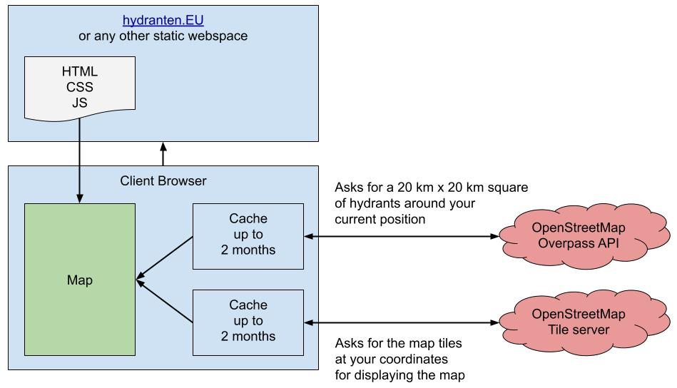

# Hydranten.EU

A map of nearby fire hydrants and other stuff

## Intent

* Simple website that shows firefighting equipment nearby.
* By default, GPS tracking is enabled, giving you a virtual radar view
  with variable zoom.
* You can disable GPS tracking using the button in the top ,
  allowing you to pan and zoom to your target in advance.
* Made from a German perspective, but meant to work worldwide, even if symbols or units (mm) don't match for now.

## Features

* Circles show you important distances (again, from a German view):
    * Grey: 20 m (standard "B" length)
    * Red: 100 m (standard reel length)
    * Black: 500 m (standard container for long distances)
* If you open the menu on the top right, the circles will disappear
  and all POIs with sufficient data will become partially transparent.
  This allows you to see at a glance, which hydrants need additional information.
* Survey mode also shows you additional buttons.
* ATTENTION: "Zurücksetzen" (reset) will update the app and delete all locally
  cached API results! Do not do this in an emergency, 
  since you may not have a network connection to download the data again,
  or the API server (run by a third party) may be unavailable!
  IF THE APP DOES NOT WORK, FALL BACK TO SEARCHING HYDRANTS THE USUAL WAY!
  Also, a nearby hydrant may be missing! (A good reason to map your hydrants in OSM!)

## Technology

* Uses the default OSM map, using https://leafletjs.com/index.html.
  Tiles are cached for up to 60 days.
* Queries POIs from the Overpass API and stores them for 60 days in local memory.
* 

## Configuration

Depending on your weakest mobile device in use,
you may want to set the following two values in the code:

* `latLonRange`: The number of degrees vertically and half of this horizontally
  in which hydrants are loaded around the viewed position.
* `movementLimit`: The number of degrees vertically and half of this horizontally
  that you have to move away from the last loading position for the app to load hydrants again.

The `movementLimit` should be about half of `latLonRange`.

## Build

`npm install`

`npm run dev` or `npm run preview`

`npm run build`

## References

* Southwest German specialty: Würtemmberger Schachthydranten: https://wiki.openstreetmap.org/wiki/DE:Tag:emergency=fire_hydrant#Besondere_Bauformen
