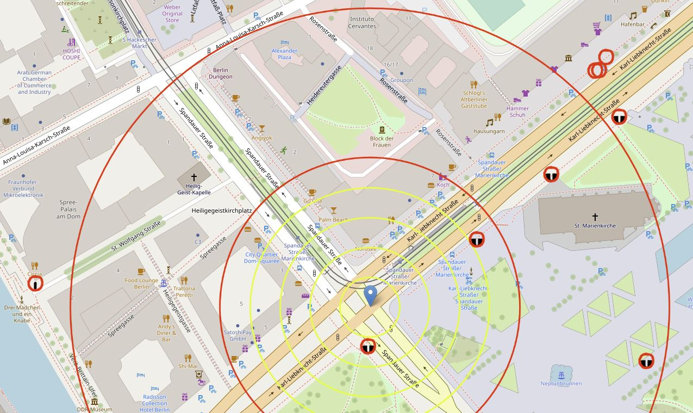

# Hydrant Radar

A map of nearby fire hydrants and other stuff

## Intent

* Simple website that shows firefighting equipment nearby.
* By default, GPS tracking is enabled, giving you a virtual radar view
with variable zoom.
* You can disable GPS tracking using the button in the top right corner,
allowing you to pan and zoom to your target in advance.
* Made from a German perspective, but meant to work worldwide, even if symbols or units (mm) don't match for now.

## Technology

* Uses the default OSM map, using https://leafletjs.com/index.html
* Queries POIs directly from the Overpass API, so updates are visible within minutes!
